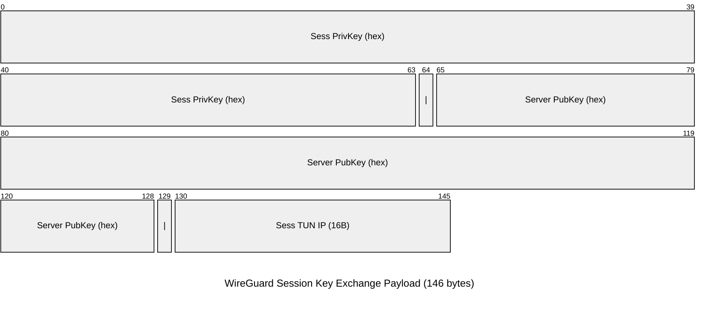
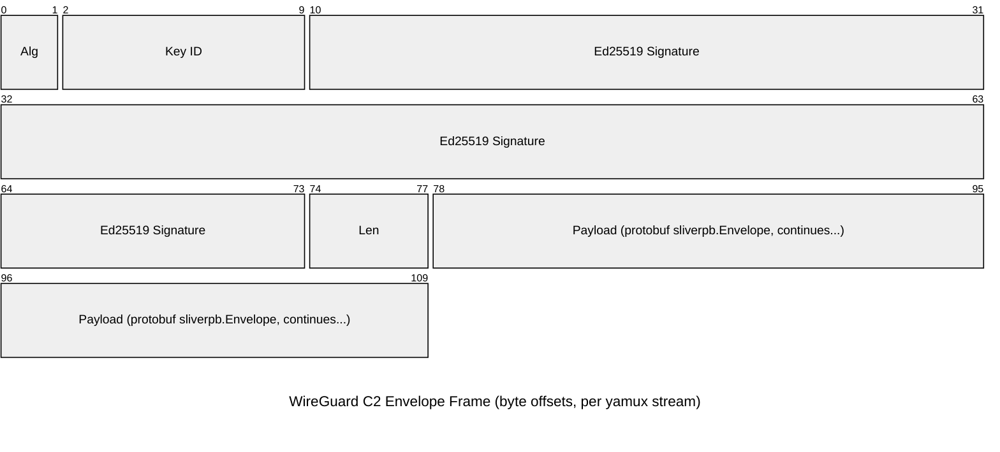

This page documents the current implant C2 WireGuard transport implementation used between `server/` and `implant/` code paths.

**Scope:** This is about implant callbacks over the `wg` listener, not operator multiplayer mode.

## Listener and Tunnel Setup

Server-side setup is implemented in `server/c2/wireguard.go` (`StartWGListener`):

1. Creates a netstack TUN with server-side tunnel IP `100.64.0.1`.
1. Loads or generates server WireGuard keys.
1. Configures a WireGuard device with known peer keys and `/32` allowed IPs.
1. Starts two TCP listeners inside the WireGuard tunnel:
   - key exchange port (default `1337`)
   - C2 transport port (default `8888`)
1. Exposes the WireGuard UDP listener (default `53`).

Defaults come from `server/rpc/rpc-jobs.go`:

- WireGuard UDP listener: `53`
- In-tunnel C2 TCP port (`NPort`): `8888`
- In-tunnel key exchange TCP port (`KeyPort`): `1337`

## Implant Connection Sequence

Implant-side transport is implemented in `implant/sliver/transports/wireguard/wireguard.go`:

1. The implant is generated with embedded WireGuard values:
   - initial implant private key
   - server public key
   - peer TUN IP
   - key-exchange and C2-in-tunnel ports
1. Implant brings up an initial WireGuard interface using those embedded values.
1. Implant dials the server key-exchange endpoint at `100.64.0.1:<key-exchange-port>`.
1. Server returns session WireGuard material and a session tunnel IP.
1. Implant tears down the initial WireGuard interface.
1. Implant brings up a new WireGuard interface using the session values.
1. Implant dials `100.64.0.1:<tcp-comms-port>`.
1. Implant sends `MUX/1` yamux preface and starts yamux.

After repeated failures, the implant will refresh session keys by running key exchange again.

## Key Exchange Payload Format

The key-exchange response payload is a fixed 146-byte message:

Notes:

- `Sess PrivKey (hex)` is the new implant WireGuard private key (64 hex chars).
- `Server PubKey (hex)` is the server WireGuard public key (64 hex chars).
- `Sess TUN IP (16B)` is raw `net.IP` bytes (not dotted string encoding).

## C2 Envelope Wire Format (Per Yamux Stream)

Each yamux stream carries a single framed envelope:

`[raw minisign signature | uint32 little-endian payload length | protobuf envelope payload]`

Notes:

- Diagram offsets are bytes (not bits) for readability.
- `Alg` = LE `uint16` (`0x6445`, EdDSA).
- `Key ID` = LE `uint64`.
- `Len` = LE `uint32` protobuf payload length.
- Raw signature size is fixed at 74 bytes: `2 + 8 + 64`.
- Length is payload length only (it does not include signature bytes).

## Envelope Payload

The payload is `sliverpb.Envelope` from `protobuf/sliverpb/sliver.proto`:

- `ID` (`int64`) request/response correlation
- `Type` (`uint32`) message type
- `Data` (`bytes`) message body
- `UnknownMessageType` (`bool`) set by implants for unsupported message types

## Message Authentication Details

Like mTLS, WireGuard C2 signs each envelope payload in addition to transport-layer encryption.

### Implant -> Server

- Implant signs marshaled envelope payloads in `implant/sliver/transports/wireguard/wireguard.go` (`WriteEnvelope`).
- Signing key derivation is deterministic from implant `PeerPrivateKey`:
  - seed = `sha256("env-signing-v1:" + peerPrivateKey)`
  - ed25519 keypair from that seed
  - key ID = first 8 bytes of `blake2b(pubKey)` as LE `uint64`
- Server verifies in `server/c2/wireguard.go` (`socketWGReadEnvelope`) by:
  - checking `EdDSA` algorithm
  - resolving key ID to an implant signing public key
  - verifying signature with ed25519

### Server -> Implant

- Server signs payloads in `server/c2/wireguard.go` (`socketWGWriteEnvelope`) using server minisign private key.
- Implant verifies in `implant/sliver/transports/wireguard/wireguard.go` (`ReadEnvelope`) using embedded server minisign public key (`MinisignVerifyRaw`).

## Runtime Behavior

- Server rejects legacy WireGuard C2 connections that do not send the `MUX/1` preface.
- Session mode sends in-band pings every 2 minutes (`PingInterval`) using `MsgPing`.
- Beacon mode and session mode both use one envelope per yamux stream.
- Server enforces max inbound payload size of `(2 * 1024 * 1024 * 1024) - 1` bytes.
