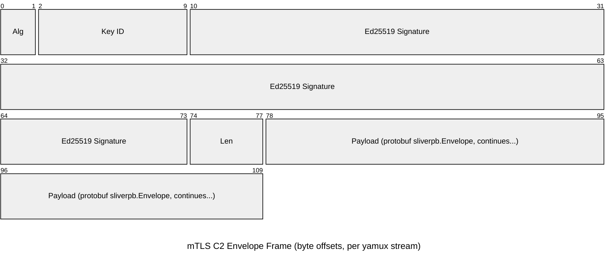

This page documents the current implant C2 mTLS transport implementation used between `server/` and `implant/` code paths.

**Scope:** This is about implant callbacks over the `mtls` listener, not operator multiplayer gRPC/mTLS mode.

## Connection Setup

The server listener implementation lives in `server/c2/mtls.go` (`StartMutualTLSListener`):

1. Starts a TLS listener (`tls.Listen`) for the configured bind/port.
1. Requires and verifies client certificates (`ClientAuth: tls.RequireAndVerifyClientCert`).
1. Uses the implant mTLS CA (`certs.MtlsImplantCA`) and enforces TLS 1.3 (`MinVersion: tls.VersionTLS13`).

The implant-side transport lives in `implant/sliver/transports/mtls/mtls.go` (`MtlsConnect` / `getTLSConfig`):

1. Dials TLS with an embedded implant cert/key and CA bundle.
1. Uses root validation via `RootOnlyVerifyCertificate(...)`.
1. Sends a yamux preface string (`MUX/1`) after TLS connects.

After the preface, both sides use yamux multiplexing:

- Server: `yamux.Server(...)` in `server/c2/mtls.go`
- Implant session/beacon: `yamux.Client(...)` in `implant/sliver/transports/session.go` and `implant/sliver/transports/beacon.go`

Each C2 envelope is sent over a yamux stream and then the stream is closed.

## mTLS Wire Format (Per Yamux Stream)

Each stream carries a single framed message:

`[raw minisign signature | uint32 little-endian payload length | protobuf envelope payload]`

Notes:

- Diagram offsets are bytes (not bits) for readability.
- `Alg` = LE `uint16` (`0x6445`, EdDSA).
- `Key ID` = LE `uint64`.
- `Len` = LE `uint32` protobuf payload length.
- Raw signature size is fixed at 74 bytes: `2 + 8 + 64`.
- Length is the protobuf payload length only (it does not include signature bytes).

## Envelope Payload

The payload is `sliverpb.Envelope` from `protobuf/sliverpb/sliver.proto`:

- `ID` (`int64`) request/response correlation
- `Type` (`uint32`) message type
- `Data` (`bytes`) message body
- `UnknownMessageType` (`bool`) set by implants for unsupported message types

## Message Authentication Details

Sliver signs each envelope payload even though the channel is already mTLS-protected.

### Implant -> Server

- Implant signs the marshaled `sliverpb.Envelope` payload in `implant/sliver/transports/mtls/mtls.go` (`WriteEnvelope`).
- Signing key derivation is deterministic from the implant peer private key:
  - seed = `sha256("env-signing-v1:" + peerPrivateKey)`
  - ed25519 keypair from that seed
  - key ID = first 8 bytes of `blake2b(pubKey)` as little-endian uint64
- Server verifies in `server/c2/mtls.go` (`socketReadEnvelope`):
  - algorithm must be `EdDSA`
  - key ID resolves to an implant signing public key via implant build metadata
  - signature is verified with ed25519

### Server -> Implant

- Server signs payloads in `server/c2/mtls.go` (`socketWriteEnvelope`) using the server minisign private key (`SignRawBuf`).
- Implant verifies in `implant/sliver/transports/mtls/mtls.go` (`ReadEnvelope`) using the embedded server minisign public key (`MinisignVerifyRaw`).

## Runtime Behavior

- Server rejects legacy mTLS connections that do not send the `MUX/1` preface.
- Session mode sends in-band pings every 2 minutes (`PingInterval`) using `MsgPing`.
- Server enforces a max inbound payload size of `(2 * 1024 * 1024 * 1024) - 1` bytes.
