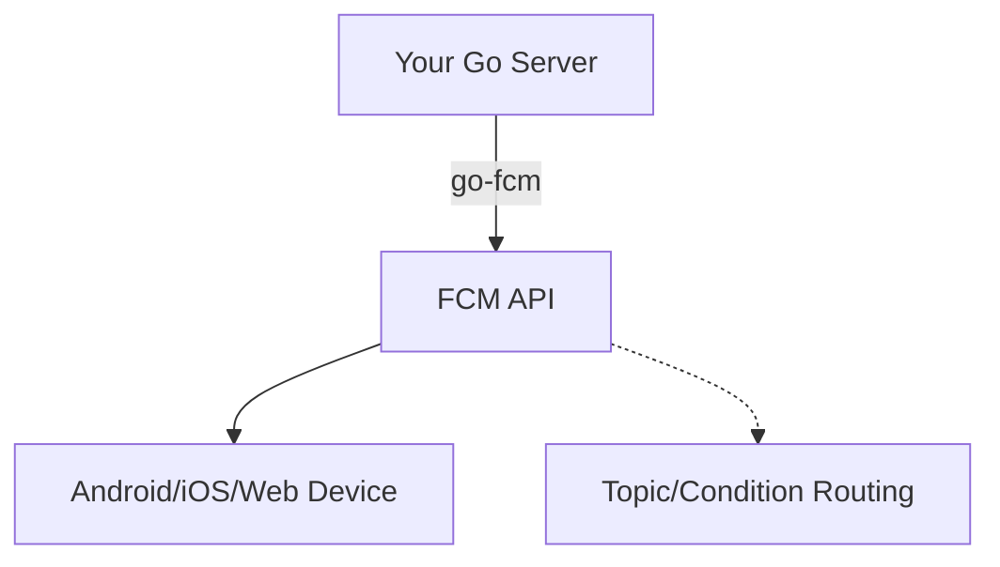

# go-fcm

[English](README.md) | [繁體中文](README.zh-tw.md) | [简体中文](README.zh-cn.md)

[](https://pkg.go.dev/github.com/appleboy/go-fcm)
[](https://github.com/appleboy/go-fcm/actions/workflows/testing.yml)
[](https://goreportcard.com/report/github.com/appleboy/go-fcm)

> Forked from [github.com/edganiukov/fcm](https://github.com/edganiukov/fcm)  
> [Firebase Cloud Messaging Official Documentation](https://firebase.google.com/docs/cloud-messaging/)

---

## Table of Contents

- [go-fcm](#go-fcm)
  - [Table of Contents](#table-of-contents)
  - [Features](#features)
  - [Supported Message Types](#supported-message-types)
  - [Quick Start](#quick-start)
  - [Authentication and Credentials](#authentication-and-credentials)
  - [Usage Example](#usage-example)
  - [Advanced Configuration](#advanced-configuration)
    - [Custom HTTP Client](#custom-http-client)
    - [Proxy Support](#proxy-support)
    - [Unit Testing and Mock](#unit-testing-and-mock)
  - [Best Practices](#best-practices)
  - [Troubleshooting](#troubleshooting)
  - [Architecture Diagram](#architecture-diagram)
  - [FAQ](#faq)
  - [License](#license)

---

## Features

| Feature                   | Supported | Description                                 |
| ------------------------- | :-------: | ------------------------------------------- |
| Single Device Messaging   |    ✅     | Send messages to a single device            |
| Multiple Device Messaging |    ✅     | Send messages to multiple devices           |
| Topic Messaging           |    ✅     | Send messages to a specific topic           |
| Condition Messaging       |    ✅     | Support for FCM condition syntax            |
| Custom HTTP Client        |    ✅     | Custom timeout, proxy, and transport config |
| Multiple Message Formats  |    ✅     | Data, Notification, Multicast               |
| Unit Test & Mock Support  |    ✅     | Easy unit testing with mock client          |

---

## Supported Message Types

| Type         | Description                                             |
| ------------ | ------------------------------------------------------- |
| Data         | Custom data messages, handled by the app                |
| Notification | System notification messages, shown in notification bar |
| Multicast    | Send to up to 500 device tokens at once                 |
| Topic        | Send to all devices subscribed to a topic               |
| Condition    | Send to devices matching a logical condition            |

---

## Quick Start

Install go-fcm:

```bash
go get github.com/appleboy/go-fcm
```

---

## Authentication and Credentials

It is recommended to use Google Application Default Credentials (ADC) for authentication.  
Download the JSON key from [Firebase Console > Settings > Service Accounts][11] and set the environment variable:

```bash
export GOOGLE_APPLICATION_CREDENTIALS="/path/to/serviceAccountKey.json"
```

Alternatively, specify the key path directly in your code.

[11]: https://console.firebase.google.com/project/_/settings/serviceaccounts/adminsdk

---

## Usage Example

```go
package main

import (
  "context"
  "fmt"
  "log"

  "firebase.google.com/go/v4/messaging"
  fcm "github.com/appleboy/go-fcm"
)

func main() {
  ctx := context.Background()
  client, err := fcm.NewClient(
    ctx,
    fcm.WithCredentialsFile("path/to/serviceAccountKey.json"),
    // fcm.WithServiceAccount("my-client-id@my-project-id.iam.gserviceaccount.com"),
  )
  if err != nil {
    log.Fatal(err)
  }

  // Send to a single device
  token := "YOUR_DEVICE_TOKEN"
  resp, err := client.Send(
    ctx,
    &messaging.Message{
      Token: token,
      Data: map[string]string{
        "foo": "bar",
      },
    },
  )
  if err != nil {
    log.Fatal(err)
  }
  fmt.Println("Success:", resp.SuccessCount, "Failure:", resp.FailureCount)

  // Send to a topic
  resp, err = client.Send(
    ctx,
    &messaging.Message{
      Data: map[string]string{
        "foo": "bar",
      },
      Topic: "highScores",
    },
  )
  if err != nil {
    log.Fatal(err)
  }

  // Send with condition
  condition := "'stock-GOOG' in topics || 'industry-tech' in topics"
  message := &messaging.Message{
    Data: map[string]string{
      "score": "850",
      "time":  "2:45",
    },
    Condition: condition,
  }
  resp, err = client.Send(ctx, message)
  if err != nil {
    log.Fatal(err)
  }

  // Send to multiple devices
  registrationToken := "YOUR_REGISTRATION_TOKEN"
  messages := []*messaging.Message{
    {
      Notification: &messaging.Notification{
        Title: "Price drop",
        Body:  "5% off all electronics",
      },
      Token: registrationToken,
    },
    {
      Notification: &messaging.Notification{
        Title: "Price drop",
        Body:  "2% off all books",
      },
      Topic: "readers-club",
    },
  }
  resp, err = client.Send(ctx, messages...)
  if err != nil {
    log.Fatal(err)
  }

  // Multicast messaging
  registrationTokens := []string{
    "YOUR_REGISTRATION_TOKEN_1",
    "YOUR_REGISTRATION_TOKEN_2",
    // ...
  }
  msg := &messaging.MulticastMessage{
    Data: map[string]string{
      "score": "850",
      "time":  "2:45",
    },
    Tokens: registrationTokens,
  }
  resp, err = client.SendMulticast(ctx, msg)
  if err != nil {
    log.Fatal(err)
  }
  fmt.Printf("%d messages were sent successfully\n", resp.SuccessCount)
  if resp.FailureCount > 0 {
    var failedTokens []string
    for idx, resp := range resp.Responses {
      if !resp.Success {
        failedTokens = append(failedTokens, registrationTokens[idx])
      }
    }
    fmt.Printf("List of tokens that caused failures: %v\n", failedTokens)
  }
}
```

---

## Advanced Configuration

### Custom HTTP Client

```go
import (
  "crypto/tls"
  "net"
  "net/http"
  "time"
  "golang.org/x/net/http2"
)

func main() {
  httpTimeout := 5 * time.Second
  tlsTimeout := 5 * time.Second

  transport := &http2.Transport{
    DialTLS: func(network, addr string, cfg *tls.Config) (net.Conn, error) {
      return tls.DialWithDialer(&net.Dialer{Timeout: tlsTimeout}, network, addr, cfg)
    },
  }

  httpClient := &http.Client{
    Transport: transport,
    Timeout:   httpTimeout,
  }

  ctx := context.Background()
  client, err := fcm.NewClient(
    ctx,
    fcm.WithCredentialsFile("path/to/serviceAccountKey.json"),
    fcm.WithHTTPClient(httpClient),
  )
}
```

### Proxy Support

```go
func main() {
  ctx := context.Background()
  client, err := fcm.NewClient(
    ctx,
    fcm.WithCredentialsFile("path/to/serviceAccountKey.json"),
    fcm.WithHTTPProxy("http://localhost:8088"),
  )
}
```

### Unit Testing and Mock

```go
import (
  "context"
  "net/http"
  "net/http/httptest"
  "testing"

  "firebase.google.com/go/v4/messaging"
  fcm "github.com/appleboy/go-fcm"
  "google.golang.org/api/option"
)

func TestMockClient(t *testing.T) {
  server := httptest.NewServer(http.HandlerFunc(func(w http.ResponseWriter, r *http.Request) {
    w.WriteHeader(http.StatusOK)
    w.Header().Set("Content-Type", "application/json")
    _, _ = w.Write([]byte(`{"name": "q1w2e3r4"}`))
  }))
  defer server.Close()

  client, err := fcm.NewClient(
    context.Background(),
    fcm.WithEndpoint(server.URL),
    fcm.WithProjectID("test"),
    fcm.WithCustomClientOption(option.WithoutAuthentication()),
  )
  if err != nil {
    t.Fatalf("unexpected error: %v", err)
  }
  resp, err := client.Send(
    context.Background(),
    &messaging.Message{
      Token: "test",
      Data: map[string]string{
        "foo": "bar",
      },
    })
  if err != nil {
    t.Fatalf("unexpected error: %v", err)
  }
  // Check response
  if resp.SuccessCount != 1 {
    t.Fatalf("expected 1 successes, got: %d", resp.SuccessCount)
  }
  if resp.FailureCount != 0 {
    t.Fatalf("expected 0 failures, got: %d", resp.FailureCount)
  }
}
```

---

## Best Practices

> [!TIP]
>
> - For batch messaging, limit each batch to no more than 500 tokens.
> - Prefer using Topics to manage device groups instead of direct token management.
> - Set your credentials file as read-only and store it securely.

---

## Troubleshooting

| Error Code         | Possible Cause & Solution                      |
| ------------------ | ---------------------------------------------- |
| `UNREGISTERED`     | Token is invalid or expired, remove from DB    |
| `INVALID_ARGUMENT` | Invalid message format, check your payload     |
| `QUOTA_EXCEEDED`   | FCM quota exceeded, try again later            |
| `UNAUTHORIZED`     | Invalid credentials, check your key and access |
| `INTERNAL`         | FCM server error, retry the request            |

---

## Architecture Diagram



---

## FAQ

- Q: How do I obtain an FCM device token?
- Q: How do I set up multi-language notifications?
- Q: How do I track message delivery status?

For more, see the [Firebase Official FAQ](https://firebase.google.com/support/faq/)

---

## License

This project is licensed under the [MIT License](LICENSE).

---
