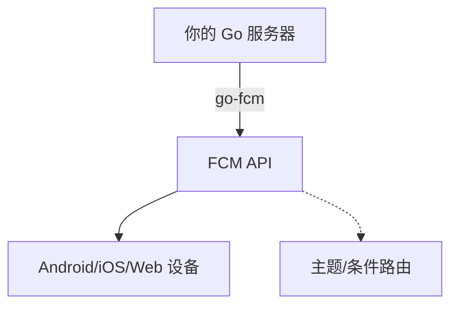

# go-fcm

[English](README.md) | [繁體中文](README.zh-tw.md) | [简体中文](README.zh-cn.md)

[](https://pkg.go.dev/github.com/appleboy/go-fcm)
[](https://github.com/appleboy/go-fcm/actions/workflows/testing.yml)
[](https://goreportcard.com/report/github.com/appleboy/go-fcm)

> 基于 [github.com/edganiukov/fcm](https://github.com/edganiukov/fcm) 分支  
> [Firebase 云消息官方文档](https://firebase.google.com/docs/cloud-messaging/)

---

## 目录

- [go-fcm](#go-fcm)
  - [目录](#目录)
  - [功能特性](#功能特性)
  - [支持的消息类型](#支持的消息类型)
  - [快速开始](#快速开始)
  - [认证与凭证](#认证与凭证)
  - [使用示例](#使用示例)
  - [高级配置](#高级配置)
    - [自定义 HTTP Client](#自定义-http-client)
    - [代理支持](#代理支持)
    - [单元测试与模拟](#单元测试与模拟)
  - [最佳实践](#最佳实践)
  - [故障排查](#故障排查)
  - [架构图](#架构图)
  - [常见问题](#常见问题)
  - [许可证](#许可证)

---

## 功能特性

| 功能               | 支持 | 说明                          |
| ------------------ | :--: | ----------------------------- |
| 单设备推送         |  ✅  | 发送消息到单一设备            |
| 多设备推送         |  ✅  | 发送消息到多个设备            |
| 主题推送           |  ✅  | 发送消息到指定主题            |
| 条件推送           |  ✅  | 支持 FCM 条件语法             |
| 自定义 HTTP Client |  ✅  | 自定义超时、代理、传输设置    |
| 多种消息格式       |  ✅  | Data、Notification、Multicast |
| 单元测试与模拟支持 |  ✅  | 便于使用 mock client 单元测试 |

---

## 支持的消息类型

| 类型         | 说明                          |
| ------------ | ----------------------------- |
| Data         | 自定义数据消息，由 App 处理   |
| Notification | 系统通知消息，显示于通知栏    |
| Multicast    | 一次发送最多 500 个设备 token |
| Topic        | 发送给订阅指定主题的所有设备  |
| Condition    | 发送给符合逻辑条件的设备      |

---

## 快速开始

安装 go-fcm：

```bash
go get github.com/appleboy/go-fcm
```

---

## 认证与凭证

推荐使用 Google Application Default Credentials (ADC) 进行认证。  
请从 [Firebase 控制台 > 设置 > 服务账号][11] 下载 JSON 密钥，并设置环境变量：

```bash
export GOOGLE_APPLICATION_CREDENTIALS="/path/to/serviceAccountKey.json"
```

也可以在代码中直接指定密钥路径。

[11]: https://console.firebase.google.com/project/_/settings/serviceaccounts/adminsdk

---

## 使用示例

```go
package main

import (
  "context"
  "fmt"
  "log"

  "firebase.google.com/go/v4/messaging"
  fcm "github.com/appleboy/go-fcm"
)

func main() {
  ctx := context.Background()
  client, err := fcm.NewClient(
    ctx,
    fcm.WithCredentialsFile("path/to/serviceAccountKey.json"),
    // fcm.WithServiceAccount("my-client-id@my-project-id.iam.gserviceaccount.com"),
  )
  if err != nil {
    log.Fatal(err)
  }

  // 发送到单一设备
  token := "YOUR_DEVICE_TOKEN"
  resp, err := client.Send(
    ctx,
    &messaging.Message{
      Token: token,
      Data: map[string]string{
        "foo": "bar",
      },
    },
  )
  if err != nil {
    log.Fatal(err)
  }
  fmt.Println("成功:", resp.SuccessCount, "失败:", resp.FailureCount)

  // 发送到主题
  resp, err = client.Send(
    ctx,
    &messaging.Message{
      Data: map[string]string{
        "foo": "bar",
      },
      Topic: "highScores",
    },
  )
  if err != nil {
    log.Fatal(err)
  }

  // 条件推送
  condition := "'stock-GOOG' in topics || 'industry-tech' in topics"
  message := &messaging.Message{
    Data: map[string]string{
      "score": "850",
      "time":  "2:45",
    },
    Condition: condition,
  }
  resp, err = client.Send(ctx, message)
  if err != nil {
    log.Fatal(err)
  }

  // 多设备推送
  registrationToken := "YOUR_REGISTRATION_TOKEN"
  messages := []*messaging.Message{
    {
      Notification: &messaging.Notification{
        Title: "价格下跌",
        Body:  "所有电子产品 5% 折扣",
      },
      Token: registrationToken,
    },
    {
      Notification: &messaging.Notification{
        Title: "价格下跌",
        Body:  "所有书籍 2% 折扣",
      },
      Topic: "readers-club",
    },
  }
  resp, err = client.Send(ctx, messages...)
  if err != nil {
    log.Fatal(err)
  }

  // Multicast 推送
  registrationTokens := []string{
    "YOUR_REGISTRATION_TOKEN_1",
    "YOUR_REGISTRATION_TOKEN_2",
    // ...
  }
  msg := &messaging.MulticastMessage{
    Data: map[string]string{
      "score": "850",
      "time":  "2:45",
    },
    Tokens: registrationTokens,
  }
  resp, err = client.SendMulticast(ctx, msg)
  if err != nil {
    log.Fatal(err)
  }
  fmt.Printf("%d 条消息发送成功\n", resp.SuccessCount)
  if resp.FailureCount > 0 {
    var failedTokens []string
    for idx, resp := range resp.Responses {
      if !resp.Success {
        failedTokens = append(failedTokens, registrationTokens[idx])
      }
    }
    fmt.Printf("失败的 token 列表: %v\n", failedTokens)
  }
}
```

---

## 高级配置

### 自定义 HTTP Client

```go
import (
  "crypto/tls"
  "net"
  "net/http"
  "time"
  "golang.org/x/net/http2"
)

func main() {
  httpTimeout := 5 * time.Second
  tlsTimeout := 5 * time.Second

  transport := &http2.Transport{
    DialTLS: func(network, addr string, cfg *tls.Config) (net.Conn, error) {
      return tls.DialWithDialer(&net.Dialer{Timeout: tlsTimeout}, network, addr, cfg)
    },
  }

  httpClient := &http.Client{
    Transport: transport,
    Timeout:   httpTimeout,
  }

  ctx := context.Background()
  client, err := fcm.NewClient(
    ctx,
    fcm.WithCredentialsFile("path/to/serviceAccountKey.json"),
    fcm.WithHTTPClient(httpClient),
  )
}
```

### 代理支持

```go
func main() {
  ctx := context.Background()
  client, err := fcm.NewClient(
    ctx,
    fcm.WithCredentialsFile("path/to/serviceAccountKey.json"),
    fcm.WithHTTPProxy("http://localhost:8088"),
  )
}
```

### 单元测试与模拟

```go
import (
  "context"
  "net/http"
  "net/http/httptest"
  "testing"

  "firebase.google.com/go/v4/messaging"
  fcm "github.com/appleboy/go-fcm"
  "google.golang.org/api/option"
)

func TestMockClient(t *testing.T) {
  server := httptest.NewServer(http.HandlerFunc(func(w http.ResponseWriter, r *http.Request) {
    w.WriteHeader(http.StatusOK)
    w.Header().Set("Content-Type", "application/json")
    _, _ = w.Write([]byte(`{"name": "q1w2e3r4"}`))
  }))
  defer server.Close()

  client, err := fcm.NewClient(
    context.Background(),
    fcm.WithEndpoint(server.URL),
    fcm.WithProjectID("test"),
    fcm.WithCustomClientOption(option.WithoutAuthentication()),
  )
  if err != nil {
    t.Fatalf("发生意外错误: %v", err)
  }
  resp, err := client.Send(
    context.Background(),
    &messaging.Message{
      Token: "test",
      Data: map[string]string{
        "foo": "bar",
      },
    })
  if err != nil {
    t.Fatalf("发生意外错误: %v", err)
  }
  // 检查响应
  if resp.SuccessCount != 1 {
    t.Fatalf("预期 1 成功，实际: %d", resp.SuccessCount)
  }
  if resp.FailureCount != 0 {
    t.Fatalf("预期 0 失败，实际: %d", resp.FailureCount)
  }
}
```

---

## 最佳实践

> [!TIP]
>
> - 批量推送时，每批建议不超过 500 个 token。
> - 推荐使用主题管理设备组，避免直接管理 token。
> - 凭证文件请设为只读并妥善保存。

---

## 故障排查

| 错误代码           | 可能原因与解决方式               |
| ------------------ | -------------------------------- |
| `UNREGISTERED`     | Token 无效或过期，请从数据库移除 |
| `INVALID_ARGUMENT` | 消息格式错误，请检查 payload     |
| `QUOTA_EXCEEDED`   | FCM 配额已满，请稍后再试         |
| `UNAUTHORIZED`     | 凭证无效，请检查密钥与访问权限   |
| `INTERNAL`         | FCM 服务器错误，请重试请求       |

---

## 架构图



---

## 常见问题

- 问：如何获取 FCM 设备 token？
- 问：如何设置多语言通知？
- 问：如何追踪消息投递状态？

更多请参见 [Firebase 官方 FAQ](https://firebase.google.com/support/faq/)

---

## 许可证

本项目采用 [MIT License](LICENSE) 授权。

---
