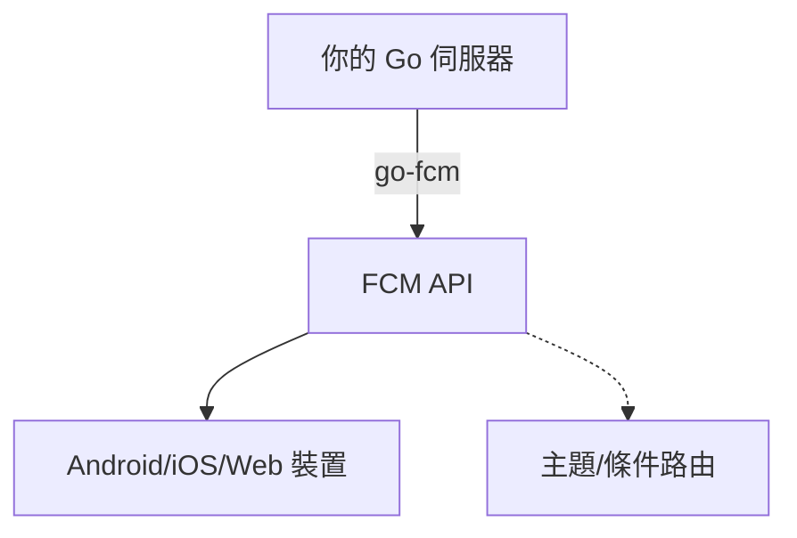

# go-fcm

[English](README.md) | [繁體中文](README.zh-tw.md) | [简体中文](README.zh-cn.md)

[](https://pkg.go.dev/github.com/appleboy/go-fcm)
[](https://github.com/appleboy/go-fcm/actions/workflows/testing.yml)
[](https://goreportcard.com/report/github.com/appleboy/go-fcm)

> 從 [github.com/edganiukov/fcm](https://github.com/edganiukov/fcm) 分支  
> [Firebase 雲端訊息官方文件](https://firebase.google.com/docs/cloud-messaging/)

---

## 目錄

- [go-fcm](#go-fcm)
  - [目錄](#目錄)
  - [功能特色](#功能特色)
  - [支援的訊息類型](#支援的訊息類型)
  - [快速入門](#快速入門)
  - [認證與憑證](#認證與憑證)
  - [使用範例](#使用範例)
  - [進階設定](#進階設定)
    - [自訂 HTTP Client](#自訂-http-client)
    - [代理伺服器支援](#代理伺服器支援)
    - [單元測試與模擬](#單元測試與模擬)
  - [最佳實踐](#最佳實踐)
  - [疑難排解](#疑難排解)
  - [架構圖](#架構圖)
  - [常見問題](#常見問題)
  - [授權條款](#授權條款)

---

## 功能特色

| 功能               | 支援 | 說明                           |
| ------------------ | :--: | ------------------------------ |
| 單一裝置推播       |  ✅  | 傳送訊息到單一裝置             |
| 多裝置推播         |  ✅  | 傳送訊息到多個裝置             |
| 主題推播           |  ✅  | 傳送訊息到特定主題             |
| 條件推播           |  ✅  | 支援 FCM 條件語法              |
| 自訂 HTTP Client   |  ✅  | 自訂逾時、代理、傳輸設定       |
| 多種訊息格式       |  ✅  | Data、Notification、Multicast  |
| 單元測試與模擬支援 |  ✅  | 方便的模擬 client 進行單元測試 |

---

## 支援的訊息類型

| 類型         | 說明                            |
| ------------ | ------------------------------- |
| Data         | 自訂資料訊息，由 App 處理       |
| Notification | 系統通知訊息，顯示於通知欄      |
| Multicast    | 一次傳送給最多 500 個裝置 token |
| Topic        | 傳送給訂閱特定主題的所有裝置    |
| Condition    | 傳送給符合邏輯條件的裝置        |

---

## 快速入門

安裝 go-fcm：

```bash
go get github.com/appleboy/go-fcm
```

---

## 認證與憑證

建議使用 Google Application Default Credentials (ADC) 進行認證。  
請從 [Firebase 控制台 > 設定 > 服務帳戶][11] 下載 JSON 金鑰，並設定環境變數：

```bash
export GOOGLE_APPLICATION_CREDENTIALS="/path/to/serviceAccountKey.json"
```

或可於程式中直接指定金鑰路徑。

[11]: https://console.firebase.google.com/project/_/settings/serviceaccounts/adminsdk

---

## 使用範例

```go
package main

import (
  "context"
  "fmt"
  "log"

  "firebase.google.com/go/v4/messaging"
  fcm "github.com/appleboy/go-fcm"
)

func main() {
  ctx := context.Background()
  client, err := fcm.NewClient(
    ctx,
    fcm.WithCredentialsFile("path/to/serviceAccountKey.json"),
    // fcm.WithServiceAccount("my-client-id@my-project-id.iam.gserviceaccount.com"),
  )
  if err != nil {
    log.Fatal(err)
  }

  // 傳送到單一裝置
  token := "YOUR_DEVICE_TOKEN"
  resp, err := client.Send(
    ctx,
    &messaging.Message{
      Token: token,
      Data: map[string]string{
        "foo": "bar",
      },
    },
  )
  if err != nil {
    log.Fatal(err)
  }
  fmt.Println("成功:", resp.SuccessCount, "失敗:", resp.FailureCount)

  // 傳送到主題
  resp, err = client.Send(
    ctx,
    &messaging.Message{
      Data: map[string]string{
        "foo": "bar",
      },
      Topic: "highScores",
    },
  )
  if err != nil {
    log.Fatal(err)
  }

  // 條件推播
  condition := "'stock-GOOG' in topics || 'industry-tech' in topics"
  message := &messaging.Message{
    Data: map[string]string{
      "score": "850",
      "time":  "2:45",
    },
    Condition: condition,
  }
  resp, err = client.Send(ctx, message)
  if err != nil {
    log.Fatal(err)
  }

  // 多裝置推播
  registrationToken := "YOUR_REGISTRATION_TOKEN"
  messages := []*messaging.Message{
    {
      Notification: &messaging.Notification{
        Title: "價格下跌",
        Body:  "所有電子產品 5% 折扣",
      },
      Token: registrationToken,
    },
    {
      Notification: &messaging.Notification{
        Title: "價格下跌",
        Body:  "所有書籍 2% 折扣",
      },
      Topic: "readers-club",
    },
  }
  resp, err = client.Send(ctx, messages...)
  if err != nil {
    log.Fatal(err)
  }

  // Multicast 推播
  registrationTokens := []string{
    "YOUR_REGISTRATION_TOKEN_1",
    "YOUR_REGISTRATION_TOKEN_2",
    // ...
  }
  msg := &messaging.MulticastMessage{
    Data: map[string]string{
      "score": "850",
      "time":  "2:45",
    },
    Tokens: registrationTokens,
  }
  resp, err = client.SendMulticast(ctx, msg)
  if err != nil {
    log.Fatal(err)
  }
  fmt.Printf("%d 則訊息傳送成功\n", resp.SuccessCount)
  if resp.FailureCount > 0 {
    var failedTokens []string
    for idx, resp := range resp.Responses {
      if !resp.Success {
        failedTokens = append(failedTokens, registrationTokens[idx])
      }
    }
    fmt.Printf("失敗的 token 清單: %v\n", failedTokens)
  }
}
```

---

## 進階設定

### 自訂 HTTP Client

```go
import (
  "crypto/tls"
  "net"
  "net/http"
  "time"
  "golang.org/x/net/http2"
)

func main() {
  httpTimeout := 5 * time.Second
  tlsTimeout := 5 * time.Second

  transport := &http2.Transport{
    DialTLS: func(network, addr string, cfg *tls.Config) (net.Conn, error) {
      return tls.DialWithDialer(&net.Dialer{Timeout: tlsTimeout}, network, addr, cfg)
    },
  }

  httpClient := &http.Client{
    Transport: transport,
    Timeout:   httpTimeout,
  }

  ctx := context.Background()
  client, err := fcm.NewClient(
    ctx,
    fcm.WithCredentialsFile("path/to/serviceAccountKey.json"),
    fcm.WithHTTPClient(httpClient),
  )
}
```

### 代理伺服器支援

```go
func main() {
  ctx := context.Background()
  client, err := fcm.NewClient(
    ctx,
    fcm.WithCredentialsFile("path/to/serviceAccountKey.json"),
    fcm.WithHTTPProxy("http://localhost:8088"),
  )
}
```

### 單元測試與模擬

```go
import (
  "context"
  "net/http"
  "net/http/httptest"
  "testing"

  "firebase.google.com/go/v4/messaging"
  fcm "github.com/appleboy/go-fcm"
  "google.golang.org/api/option"
)

func TestMockClient(t *testing.T) {
  server := httptest.NewServer(http.HandlerFunc(func(w http.ResponseWriter, r *http.Request) {
    w.WriteHeader(http.StatusOK)
    w.Header().Set("Content-Type", "application/json")
    _, _ = w.Write([]byte(`{"name": "q1w2e3r4"}`))
  }))
  defer server.Close()

  client, err := fcm.NewClient(
    context.Background(),
    fcm.WithEndpoint(server.URL),
    fcm.WithProjectID("test"),
    fcm.WithCustomClientOption(option.WithoutAuthentication()),
  )
  if err != nil {
    t.Fatalf("發生非預期錯誤: %v", err)
  }
  resp, err := client.Send(
    context.Background(),
    &messaging.Message{
      Token: "test",
      Data: map[string]string{
        "foo": "bar",
      },
    })
  if err != nil {
    t.Fatalf("發生非預期錯誤: %v", err)
  }
  // 檢查回應
  if resp.SuccessCount != 1 {
    t.Fatalf("預期 1 成功，實際: %d", resp.SuccessCount)
  }
  if resp.FailureCount != 0 {
    t.Fatalf("預期 0 失敗，實際: %d", resp.FailureCount)
  }
}
```

---

## 最佳實踐

> [!TIP]
>
> - 批次推播時，每批建議不超過 500 個 token。
> - 建議使用主題管理裝置群組，避免直接管理 token。
> - 憑證檔案請設為唯讀並妥善保存。

---

## 疑難排解

| 錯誤代碼           | 可能原因與解決方式               |
| ------------------ | -------------------------------- |
| `UNREGISTERED`     | Token 無效或過期，請從資料庫移除 |
| `INVALID_ARGUMENT` | 訊息格式錯誤，請檢查 payload     |
| `QUOTA_EXCEEDED`   | FCM 配額已滿，請稍後再試         |
| `UNAUTHORIZED`     | 憑證無效，請檢查金鑰與存取權限   |
| `INTERNAL`         | FCM 伺服器錯誤，請重試請求       |

---

## 架構圖



---

## 常見問題

- 問：如何取得 FCM 裝置 token？
- 問：如何設定多語系通知？
- 問：如何追蹤訊息傳遞狀態？

更多請參考 [Firebase 官方 FAQ](https://firebase.google.com/support/faq/)

---

## 授權條款

本專案採用 [MIT License](LICENSE) 授權。

---
