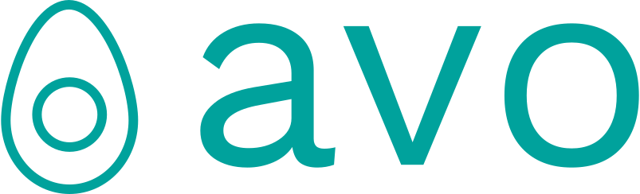

<p align="center">
  
  <br />
  <a href="https://travis-ci.org/mmcloughlin/avo"></a>
  <a href="http://godoc.org/github.com/mmcloughlin/avo"></a>
  <a href="https://goreportcard.com/report/github.com/mmcloughlin/avo"></a>
</p>

<p align="center">Generate x86 Assembly with Go</p>

`avo` makes high-performance Go assembly easier to write, review and maintain. The `avo` package presents a familiar assembly-like interface that simplifies development without sacrificing performance:

* **Use Go control structures** for assembly generation; `avo` programs _are_ Go programs
* **Register allocation**: write functions with virtual registers and `avo` assigns physical registers for you
* **Automatically load arguments and store return values**: ensure memory offsets are correct for complex structures
* **Generation of stub files** to interface with your Go package

_Note: APIs subject to change while `avo` is still in an experimental phase. You can use it to build [real things](examples) but we suggest you pin a version with your package manager of choice._

## Quick Start

Install `avo` with `go get`:

```
$ go get -u github.com/mmcloughlin/avo
```

`avo` assembly generators are pure Go programs. Here's a function that adds two `uint64` values:

[embedmd]:# (examples/add/asm.go)
```go
// +build ignore

package main

import . "github.com/mmcloughlin/avo/build"

func main() {
	TEXT("Add", NOSPLIT, "func(x, y uint64) uint64")
	Doc("Add adds x and y.")
	x := Load(Param("x"), GP64())
	y := Load(Param("y"), GP64())
	ADDQ(x, y)
	Store(y, ReturnIndex(0))
	RET()
	Generate()
}
```

`go run` this code to see the assembly output. To integrate this into the rest of your Go package we recommend a [`go:generate`](https://blog.golang.org/generate) line to produce the assembly and the corresponding Go stub file.

[embedmd]:# (examples/add/add_test.go go /.*go:generate.*/)
```go
//go:generate go run asm.go -out add.s -stubs stub.go
```

After running `go generate` the [`add.s`](examples/add/add.s) file will contain the Go assembly.

[embedmd]:# (examples/add/add.s)
```s
// Code generated by command: go run asm.go -out add.s -stubs stub.go. DO NOT EDIT.

#include "textflag.h"

// func Add(x uint64, y uint64) uint64
TEXT ·Add(SB), NOSPLIT, $0-24
	MOVQ x+0(FP), AX
	MOVQ y+8(FP), CX
	ADDQ AX, CX
	MOVQ CX, ret+16(FP)
	RET
```

The same call will produce the stub file [`stub.go`](examples/add/stub.go) which will enable the function to be called from your Go code.

[embedmd]:# (examples/add/stub.go)
```go
// Code generated by command: go run asm.go -out add.s -stubs stub.go. DO NOT EDIT.

package add

// Add adds x and y.
func Add(x uint64, y uint64) uint64
```

See the [`examples/add`](examples/add) directory for the complete working example.

## Examples

See [`examples`](examples) for the full suite of examples.

### Slice Sum

Sum a slice of `uint64`s:

[embedmd]:# (examples/sum/asm.go /func main/ /^}/)
```go
func main() {
	TEXT("Sum", NOSPLIT, "func(xs []uint64) uint64")
	Doc("Sum returns the sum of the elements in xs.")
	ptr := Load(Param("xs").Base(), GP64())
	n := Load(Param("xs").Len(), GP64())

	Comment("Initialize sum register to zero.")
	s := GP64()
	XORQ(s, s)

	Label("loop")
	Comment("Loop until zero bytes remain.")
	CMPQ(n, Imm(0))
	JE(LabelRef("done"))

	Comment("Load from pointer and add to running sum.")
	ADDQ(Mem{Base: ptr}, s)

	Comment("Advance pointer, decrement byte count.")
	ADDQ(Imm(8), ptr)
	DECQ(n)
	JMP(LabelRef("loop"))

	Label("done")
	Comment("Store sum to return value.")
	Store(s, ReturnIndex(0))
	RET()
	Generate()
}
```

The result from this code generator is:

[embedmd]:# (examples/sum/sum.s)
```s
// Code generated by command: go run asm.go -out sum.s -stubs stub.go. DO NOT EDIT.

#include "textflag.h"

// func Sum(xs []uint64) uint64
TEXT ·Sum(SB), NOSPLIT, $0-32
	MOVQ xs_base+0(FP), AX
	MOVQ xs_len+8(FP), CX

	// Initialize sum register to zero.
	XORQ DX, DX

loop:
	// Loop until zero bytes remain.
	CMPQ CX, $0x00
	JE   done

	// Load from pointer and add to running sum.
	ADDQ (AX), DX

	// Advance pointer, decrement byte count.
	ADDQ $0x08, AX
	DECQ CX
	JMP  loop

done:
	// Store sum to return value.
	MOVQ DX, ret+24(FP)
	RET
```

Full example at [`examples/sum`](examples/sum).

### Features

For demonstrations of `avo` features:

* **[args](examples/args):** Loading function arguments.
* **[returns](examples/returns):** Building return values.
* **[complex](examples/complex):** Working with `complex{64,128}` types.
* **[data](examples/data):** Defining `DATA` sections.
* **[ext](examples/ext):** Interacting with types from external packages.

### Real Examples

Implementations of full algorithms:

* **[sha1](examples/sha1):** [SHA-1](https://en.wikipedia.org/wiki/SHA-1) cryptographic hash.
* **[fnv1a](examples/fnv1a):** [FNV-1a](https://en.wikipedia.org/wiki/Fowler%E2%80%93Noll%E2%80%93Vo_hash_function#FNV-1a_hash) hash function.
* **[dot](examples/dot):** Vector dot product.
* **[geohash](examples/geohash):** Integer [geohash](https://en.wikipedia.org/wiki/Geohash) encoding.
* **[stadtx](examples/stadtx):** [`StadtX` hash](https://github.com/demerphq/BeagleHash) port from [dgryski/go-stadtx](https://github.com/dgryski/go-stadtx).

## Contributing

Contributions to `avo` are welcome:

* Feedback from using `avo` in a real project is incredibly valuable. Consider [porting an existing project to `avo`](https://github.com/mmcloughlin/avo/issues/40).
* [Submit bug reports](https://github.com/mmcloughlin/avo/issues/new) to the issues page.
* Pull requests accepted. Take a look at outstanding [issues](https://github.com/mmcloughlin/avo/issues) for ideas (especially the ["good first issue"](https://github.com/mmcloughlin/avo/labels/good%20first%20issue) label).

## Credits

Inspired by the [PeachPy](https://github.com/Maratyszcza/PeachPy) and [asmjit](https://github.com/asmjit/asmjit) projects. Thanks to [Damian Gryski](https://github.com/dgryski) for advice, and his [extensive library of PeachPy Go projects](https://github.com/mmcloughlin/avo/issues/40).

## License

`avo` is available under the [BSD 3-Clause License](LICENSE).
